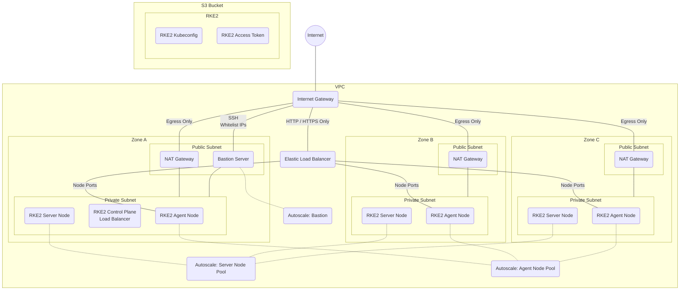

# Big Bang Infrastructure as Code (IaC)

#### _This is a mirror of a government repo hosted on [Repo1](https://repo1.dso.mil/) by [DoD Platform One](http://p1.dso.mil/).  Please direct all code changes, issues and comments to https://repo1.dso.mil/platform-one/big-bang/customers/template_

The terraform/terragrunt code in this directory will setup all the infrastructure for a Big Bang deployment in Amazon Web Services (AWS).  It starts from scratch with a new VPC and finishes by deploying a multi-node [RKE2 Cluster](https://docs.rke2.io/).  The infrastructure and cluster provisioned can then be used to deploy Big Bang.

> This code is intended to be a forkable starting point / example for users to get their infrastructure setup quickly.  It is up to the users to futher customize and secure the infrastructure for the intended use.

## Layout

The following directory tree shows the layout of the the configuration files in this repository.  Users should be able to customize the most common items by adjusting values in the `.yaml` files.  Additional regions and/or environment directories can be created to maintain multiple deployments without changing the main terraform code.

```text
terraform
└── main                # Shared terraform code
└── us-gov-west-1       # Terragrunt code for a specific AWS region
    ├── region.yaml     # Regional configuration
    └── prod            # Teragrunt code for a specific environment (e.g. prod, stage, dev)
        └── env.yaml    # Environment specific configuration
```

## Prerequisites

- An AWS cloud account with admin privileges
- [Terraform](https://www.terraform.io/downloads.html)
- [Terragrunt](https://terragrunt.gruntwork.io/docs/getting-started/install/)
- [AWS CLI](https://docs.aws.amazon.com/cli/latest/userguide/install-cliv2.html)
- [Kubectl](https://kubernetes.io/docs/tasks/tools/#kubectl)

## Quickstart

- Review the configuration
  - Review [region.yaml](./us-gov-west-1/region.yaml).  Update your deployment region if necessary.
  - Review [env.yaml](./us-gov-west-1/prod/env.yaml).  At a minimum, update `name` to identify your deployment.

- Validate your configuration

    ```bash
    cd ./terraform/us-gov-west-1/prod
    terragrunt run-all validate
    # Successful output: Success! The configuration is valid.
    ```

- Run the deployment

    ```bash
    # Initialize
    terragrunt run-all init

    # Pre-check
    terragrunt run-all plan

    # Deploy
    # WARNING: This will spin up infrastructure on your AWS account tuned for a lightly loaded production environment, this incurs cost!
    terragrunt run-all apply
    ```

- Connect to cluster

    ```bash
    # Setup your cluster name (same as `name` in `env.yaml`)
    export CNAME="bigbang-dev"

    # Get Bastion Security Group ID
    export BSG=`aws ec2 describe-instances --filters "Name=tag:Name,Values=$CNAME-bastion" --query 'Reservations[*].Instances[*].SecurityGroups[*].GroupId' --output text`

    # Get your public IP address
    export MYIP=`curl -s http://checkip.amazonaws.com/`

    # Add SSH ingress for your IP to the bastion security group
    aws ec2 authorize-security-group-ingress --group-id $BSG --protocol tcp --port 22 --cidr $MYIP/32

    # Get Bastion public IP address
    export BIP=`aws ec2 describe-instances --filters "Name=tag:Name,Values=$CNAME-bastion" --query 'Reservations[*].Instances[*].PublicIpAddress' --output text`

    # Use sshuttle to tunnel traffic through bastion public IP
    # You can add the '-D' option to sshuttle to run this as a daemon.
    # Otherwise, you will need another terminal to continue.
    sshuttle --dns -vr ec2-user@$BIP 10.0.0.0/8 --ssh-cmd "ssh -i ~/.ssh/$CNAME.pem"

    # Validate connectivity
    kubectl get no
    ```

  > If you get an error with `sshuttle` where Python is not installed, you can manually install it by using the following:
  >
  > ```shell
  > ssh -i ~/.ssh/$CNAME.pem ec2-user@$BIP
  > sudo yum update -y
  > sudo yum install -y python3
  > exit
  > ```

The infrastructure is now setup.  You still need to configure the Big Bang specific [cluster pre-requisites](#big-bang-cluster-pre-requisites).

## Big Bang Cluster Pre-Requisites

Prior to installing Big Bang, there are a few cluster agnostic specific pre-requisites that must be set up before proceeding, these are outlined below, or on Big Bang's [prerequisites page](https://repo1.dso.mil/platform-one/big-bang/bigbang/-/tree/master/docs/guides/prerequisites).
Prior to deploying Big Bang, you should setup the following in the Kubernetes cluster created by the [Quickstart](#quickstart).

### Storage Class

By default, Big Bang will use the cluster's default `StorageClass` to dynamically provision the required persistent volumes.  This means the cluster must be able to dynamically provision PVCs.  Since we're on AWS, the simplest method is to use the [AWS EBS](https://docs.aws.amazon.com/AWSEC2/latest/UserGuide/AmazonEBS.html) Storage Class using Kubernetes' in tree [AWS cloud provider](https://kubernetes.io/docs/concepts/storage/storage-classes/#aws-ebs).

> Without a default storage class, some Big Bang components, like Elasticsearch, Jaeger, or Twistlock, will never reach the running state.

```bash
kubectl apply -f ./terraform/storageclass/ebs-gp2-storage-class.yaml
```

If you have an alternative storage class, you can run the following to replace the EBS GP2 one provided.

```bash
kubectl patch storageclass ebs -p '{"metadata": {"annotations":{"storageclass.kubernetes.io/is-default-class":"false"}}}'

# Install your storage of choice, for example...
# For example...
# OpenEBS: https://docs.openebs.io/docs/next/installation.html
# Longhorn: https://longhorn.io/docs/1.0.0/deploy/install/
# Rook: https://rook.io/docs/rook/v1.6/ceph-quickstart.html
kubectl patch storageclass <name of your storage class> -p '{"metadata": {"annotations":{"storageclass.kubernetes.io/is-default-class":"true"}}}'
```

### Node Ports

To ensure ingress into the cluster, load balancers must be configured to ensure proper port mappings for `istio`.  The simplest method is the default scenario, where the cluster (`rke2` in this example) is running the appropriate cloud provider capable of dynamically provisioning load balancers when requesting `Services` of `type: LoadBalancer`.  This is the default configuration in BigBang, and if you choose to continue this way, you can skip the following steps.

However, for brevity in this example, we are introducing an alternative, where the load balancer is preprovisioned and owned by terraform (from your earlier apply step). This provides more control over the load balancer, but also requires the extra step of informing `istio` on installation of the required ports to expose on each node that the pre-created load balancer should forward to.  It's important to note these are the _exact_ same steps that the cloud provider would take if we let Kubernetes provision things for us.

The following configuration in Big Bang's values.yaml will setup the appropriate `NodePorts` to match the [Quickstart](#quickstart) configuration.

```yaml
# Big Bang's values.yaml
istio:
  values:
    ingressGateway:
      # Use Node Ports instead of creating a load balancer
      type: NodePort
      ports:
        - name: status          # Istio's default health check port
          port: 15021
          targetPort: 15021
          nodePort: 32021       # Port configured in terraform ELB
        - name: http2
          port: 80
          targetPort: 8080
          nodePort: 30080       # Port configured in terraform ELB
        - name: https
          port: 443
          targetPort: 8443
          nodePort: 30443       # Port configured in terraform ELB
        - name: sni             # Istio's SNI Routing port
          port: 15443
          targetPort: 15443
          nodePort: 32443       # Port configured in terraform ELB
```

> The node port values can be customized using the `node_port_*` inputs to the [elb terraform](./modules/elb).

## Deploying Big Bang

The cluster is now ready for a Big Bang installation.  To deploy Big Bang, please see the accompanying documentation at this repositories [main readme](../README.md).

## Post Deployment

After Big Bang is deployed, you will need to [setup DNS entries to point to the Elastic Load Balancer](https://docs.aws.amazon.com/elasticloadbalancing/latest/classic/using-domain-names-with-elb.html?icmpid=docs_elb_console).  You can also connect without DNS using the [debug steps below](#debug)

## Infrastructure

### Manifest

Once the terraform has run, you will have the following resources deployed:

- [Virtual Private Cloud (VPC)](https://aws.amazon.com/vpc/?vpc-blogs.sort-by=item.additionalFields.createdDate&vpc-blogs.sort-order=desc)
- [Internet Gateway](https://docs.aws.amazon.com/vpc/latest/userguide/VPC_Internet_Gateway.html)
- Public subnets
  - One for each [availability zone](https://docs.aws.amazon.com/AWSEC2/latest/UserGuide/using-regions-availability-zones.html)
  - VPC CIDR traffic routed locally
  - Connected to Internet
- Private subnets
  - One for each [availability zone](https://docs.aws.amazon.com/AWSEC2/latest/UserGuide/using-regions-availability-zones.html)
  - VPC CIDR traffic routed locally
  - Other traffic routed to [NAT Gateway](https://docs.aws.amazon.com/vpc/latest/userguide/vpc-nat-gateway.html)
- NAT Gateway
  - [Elastic IP](https://docs.aws.amazon.com/AWSEC2/latest/UserGuide/elastic-ip-addresses-eip.html) assigned for internet access
  - Prevents internet ingress to private subnet
  - Allows internet egress from private subnet
- [RKE2](https://docs.rke2.io/) Kubernetes Cluster
  - RKE2 Control Plane
  - RKE2 Servers
    - Autoscaled node pool
    - Anti-affinity
  - RKE2 Agents (Generic)
    - Autoscaled node pool
    - Anti-affinity
  - Security Groups
    - Egress not restricted
    - Internal cluster ingress allowed
    - Control Plane traffic limited to port 6443 and 9345 to servers
  - SSH keys created and stored on all nodes.  Private key is stored locally in `~/.ssh`
- Elastic Load Balancer
  - Internet facing
  - Security group allows ingress on ports 80 and 443 only
  - Balances loads to RKE2 agents
- [CoreDNS](https://coredns.io/)
- [Metrics Server](https://github.com/kubernetes-sigs/metrics-server)
- Bastion
  - Autoscale group insures one bastion is available
  - Security group allows SSH on Whitelist IP
  - Python installed to allow sshuttle to function
- S3 Storage Bucket
  - RKE2 Kubeconfig for accessing cluster
  - RKE2 access token for adding additional nodes

### Diagram



## Debug

After Big Bang deployment, if you wish to access your deployed web applications that are not exposed publically, add an entry into your /etc/hosts to point the host name to the elastic load balancer.

> This bypasses load balancing since you are using the resolved IP address of one of the connected nodes in the pool

```bash
# Setup cluster name from env.yaml
export CName="bigbang-dev"

# Get VPC info
export VPCId=`aws ec2 describe-vpcs --filters "Name=tag:Name,Values=$CName" --query 'Vpcs[*].VpcId' --output text`

# Get load balancer in VPC that does not contain cluster name
# Istio in Big Bang creates a load balancer
export LBDNS=`aws elb describe-load-balancers --query "LoadBalancerDescriptions[? VPCId == '$VPCId' && "'!'"contains(DNSName, 'internal')].DNSName" --output text`

# Retrieve IP address of load balancer for /etc/hosts
export ELBIP=`dig $LBDNS +short | head -1`

# Now add the hostname of the web appliation into /etc/hosts (or `C:\Windows\System32\drivers\etc\hosts` on Windows)
# You may need to log out and back into for hosts to take effect
printf "\nAdd the following line to /etc/hosts to alias Big Bang core products:\n${ELBIP}    twistlock.bigbang.dev kibana.bigbang.dev prometheus.bigbang.dev grafana.bigbang.dev tracing.bigbang.dev kiali.bigbang.dev alertmanager.bigbang.dev\n\n"
```

## Terraform Destroy

If you need to teardown the infrastructure, you need to follow this procedure to insure success:

```shell
# Uninstall Big Bang (sshuttle must be running)
helm delete -n bigbang bigbang

# Stop sshuttle
pkill sshuttle

# Destroy
terragrunt run-all destroy
```

## Optional Terraform

Depending on your needs, you may want to deploy additional infrastructure, such as Key Stores, S3 Buckets, or Databases, that can be used with your deployment.  In the [options](./options) directory, you will find terraform / terragrunt snippits that can assist you in deploying these items.

> These examples may required updates to be compatible with the [Quickstart](#quickstart)

## Additional Resources

- [Rancher Kubernetes Engine Government (RKE2) Docs](https://docs.rke2.io/)
- [RKE2 AWS Terraform Docs](https://github.com/rancherfederal/rke2-aws-tf)
